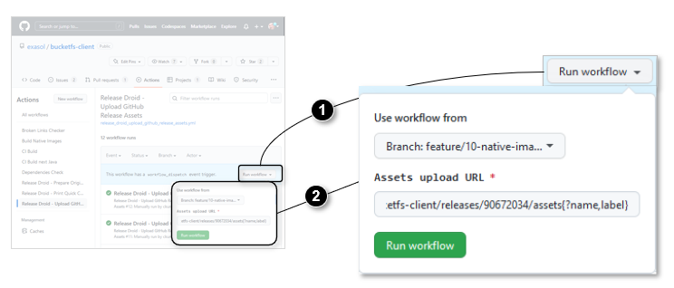

# Building Native Executables

## CI-Build vs. Release

Native executables can be built in two different life cycle phases. The phases are implemented in different workflow scripts, have additional differences and address different goals.

|                         | ci-build                         | release workflow                                 |
|-------------------------|----------------------------------|--------------------------------------------------|
| triggered by event      | push to a pull request           | release                                          |
| project-keeper template | `ci-build.yml`                   | `release_droid_upload_github_release_assets.yml` |
| uses GitHub Action      | [actions/upload-artifact](https://github.com/actions/upload-artifact) | [shogo82148/actions-upload-release-asset](https://github.com/shogo82148/actions-upload-release-asset) |
| content of uploads      | zip archive containing the asset | just the asset file itself                       |
| destination of uploads  | current workflow run             | release                                          |

Goals
* ci-build:
  * ensure the native executables can be built successfully
  * execute integration tests using the native executables
* release workflow:
  * bundle the final release containing all artifacts for end users

Bucketfs-client (BFSC) supports native executables in both workflows.

* In addition to the unchanged workflow script `ci-build.yml` from template BFSC adds the dedicated script `build-native-images.yml`.
* For releases BFSC uses a modified version of file `release_droid_upload_github_release_assets.yml`.

## Matrix strategy

Each workflow uses a matrix strategy containing the platforms the native executables should be built for. The following example will execute the workflow three times for each of operating system at a time:

```yaml
strategy:
  matrix:
    os: [ windows-latest, ubuntu-latest ]
```

The name of each of the elements of the matrix is used to define the execution platform for the GitHub runner:

```yaml
runs-on: ${{ matrix.os }}
```

Using the `include` directive the workflow script defines an additional property `binary` for later use.

```yaml
include:
  - os: windows-latest
    binary: bfsc.exe
  - os: ubuntu-latest
    binary: bfsc
```

## Graal VM Tool `native-image`

The native executables are build using command `native-image` provided by GitHub action template [graalvm/setup-graalvm](https://github.com/graalvm/setup-graalvm).

Please note that for windows platform `native-image` automatically appends suffix `.exe`.

## Creating SHA256 Checksum Files

To enable end users to verify the validity and integrity of the files offered for download, BFSC's build script creates a corresponding checksum file of each file contained in a release. The following table shows the command used on each of the operating systems:

| Operating system | Command                                      | Reference |
|------------------|----------------------------------------------|-----------|
| Ubuntu Linux     | bash, `sha256sum`                            |           |
| Windows          | Powershell, `Get-FileHash -Algorithm SHA256` | [Create sha256 checksum on Windows with Powershell](https://learn.microsoft.com/en-us/powershell/module/microsoft.powershell.utility/get-filehash?view=powershell-7.3) |
| Mac OS           | `shasum -a 256`                              | [Create sha256 checksum on MacOS](https://unix.stackexchange.com/questions/426837/no-sha256sum-in-macos) |

For Windows Powershell there are some additional considerations described in the following table:

| Problem | Description | Solution |
|---------|-------------|----------|
| Uppercase checksum | Linux and MacOS Checksums seem to be lowercase characters while windows prefers uppercase. | BFSC's build script unifies this by adding Powershell cmdlet `ToLower()`. |
| [BOM (Byte order mark) for UTF-8 files](https://learn.microsoft.com/en-us/powershell/module/microsoft.powershell.core/about/about_character_encoding?view=powershell-7.3) | By default (depending on its version) Powershell might add a BOM to the generated file, which could break other tools. | BFSC's build script provides SHA256 checksum files *without* BOM. |
| [Executing Powershell scripts](https://stackoverflow.com/questions/2035193/how-to-run-a-powershell-script) | Executing Powershell scripts either requires the script to be *signed* or the operating system be configured to allow execution of unsigned scripts. | To avoid these dependencies BFSC's build script uses a single command line instead of a script file. |

## Testing the Release Script

Full releases are time-consuming and modify the Git repository by creating a Git Tag.-
To test creation and upload of native executables, you can use the following approach

1. Create a draft release
2. Test creation and upload of native executables
3. Remove the draft release

Step 1 needs to be done by a script for two reasons
* Make the draft available for your tests with sufficient duration
* Reveal the "Upload URL" required to test actual upload of artifacts

### Script to Create Draft Release

An appropriate Python script for creating a release is

```python
from github import Github
api = Github("<your github token>")
repo = api.get_repo("exasol/bucketfs-client")
release = repo.create_git_release("tag", "Release Name", "Release Message", draft=True)
print(f"Upload URL: {release.upload_url}")
```

See also [GitHub API](https://pygithub.readthedocs.io/en/latest/github_objects/Repository.html).

### Trigger Workflow Manually

For step 2 you can
1. Navigate to the action [release_droid_upload_github_release_assets.yml](https://github.com/exasol/bucketfs-client/actions/workflows/release_droid_upload_github_release_assets.yml)
2. Click button "Run workflow"
3. Select the branch you are currently working on
4. Enter the Upload URL displayed by the script above, including suffix `{?name,label}`
5. Click green button "Run workflow"


